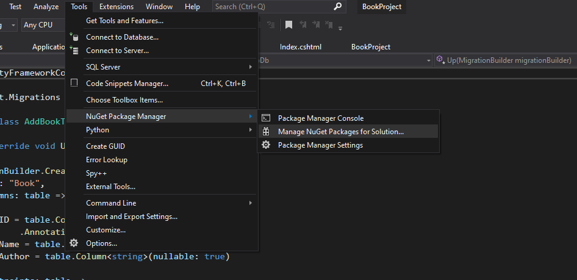

# Learning-ASP-NET
Repository for learning C# with ASP.NET for developing web applications.

## Getting Started
Will need:
1) Microsoft Visual Studio 2019+
2) .NET Core 3.1
3) Microsoft SQL Server 2019+ Developer Version
4) Microsoft SQL Server Management Studio (SSMS)

## Creating Project with Razor
* Select ASP.NET Core Web Application as project template
* Provide a name for the project and location where it will be stored

## To Add More Packages to Project
* Click on tools on navigation bar
* Click on NuGet Package Manager and Select Manage NuGet Packages for Solution
* Move to the Browse Tab in Package Manager


### Recommended Packages:
Razor.RuntimeCompilation allows you to see changes in front end code simultaneously 

## Issues with SSL Certificates
Sometimes you will get errors with launching application:
```
'Adding the Certificate to The Trusted Root Certificates store failed with the following Errror. Access is denied'
```

To fix this you need to remove certificates from local and import them into trusted.
https://stackoverflow.com/questions/47413183/visual-studio-2017-gives-adding-the-certificate-to-the-trusted-root-certificate

# Adding Databases in Razor
## Adding Models
* Click on project folder 
* Add folder and call it Model
* Then in this folder create a C# Class called Book (this is going to be the name of a table in our database)

## Setting up the Database
These are some of the packages that need to be installed to use SQL Server with ASP.NET
* Microsoft.EntityFrameworkCore  (used to access database)
* Microsoft.EntityFrameworkCore.SqlServer
* Microsoft.EntityFrameworkCore.tools (used for migrations)

Then to set up a connection to the DB in appsettings.json
```json
"ConnectionStrings": {
    "DefaultConnection": "Server=DESKTOP-0004HJQ; Database=BookList; Trusted_Connection=True; MultipleActiveResultSets=True"
  },
```

## Configuring Database 
* Add a new C# Class called ApplicationDbContext inside Model folder 
* This class should inherit from Dbcontext class
```C#
public class ApplicationDbContext : DbContext
    {
        // Type ctor and press tab twice to autocomplete constructor
        public ApplicationDbContext(DbContextOptions<ApplicationDbContext> options) : base(options)
        {
            // This constructor is empty but required for dependency injection
        }

        public DbSet<Book> Book { get; set; }
```

